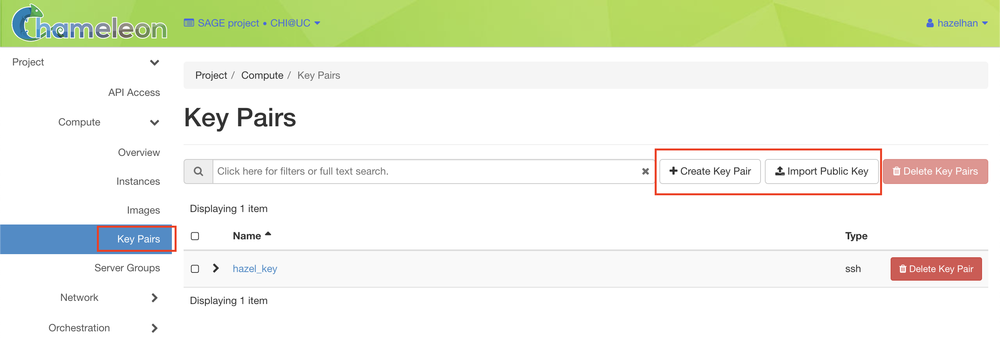
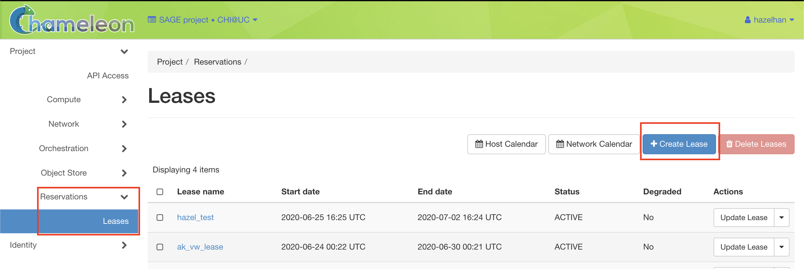
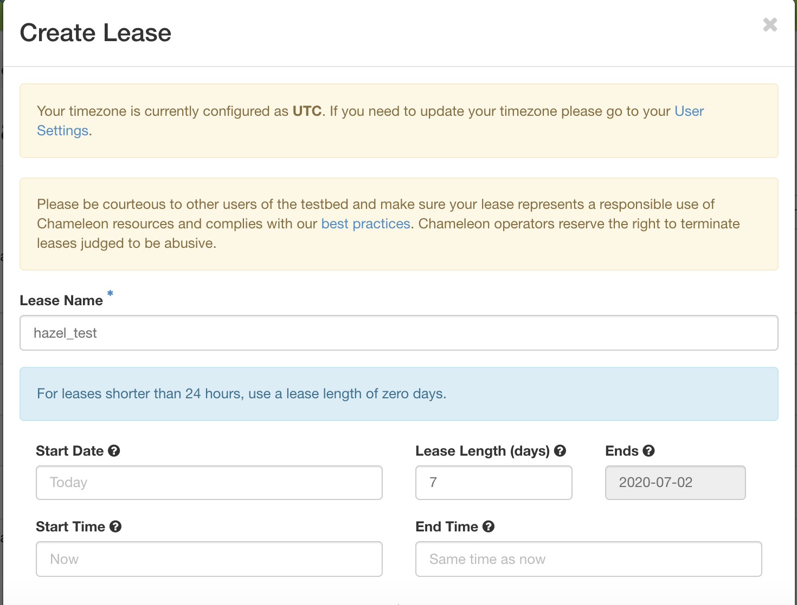
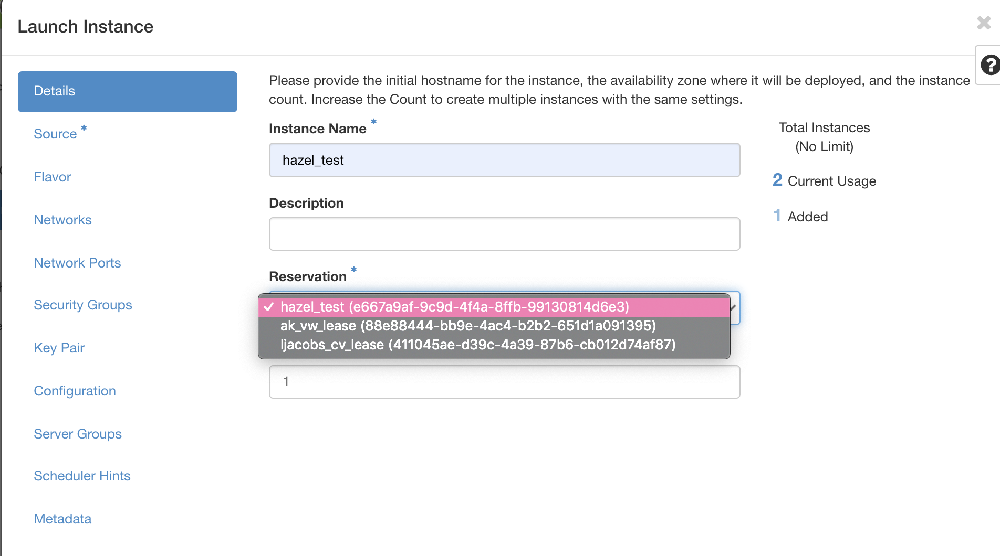
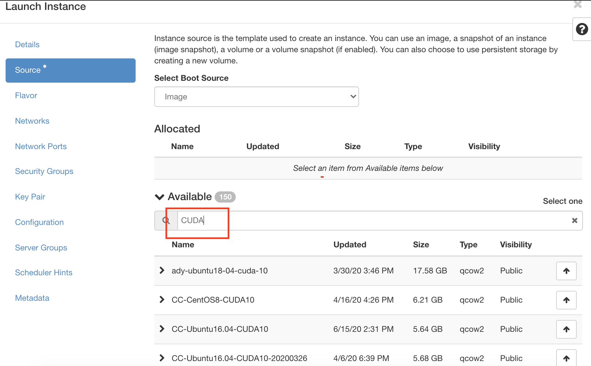
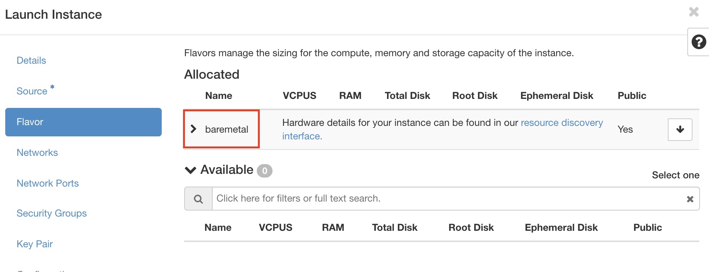
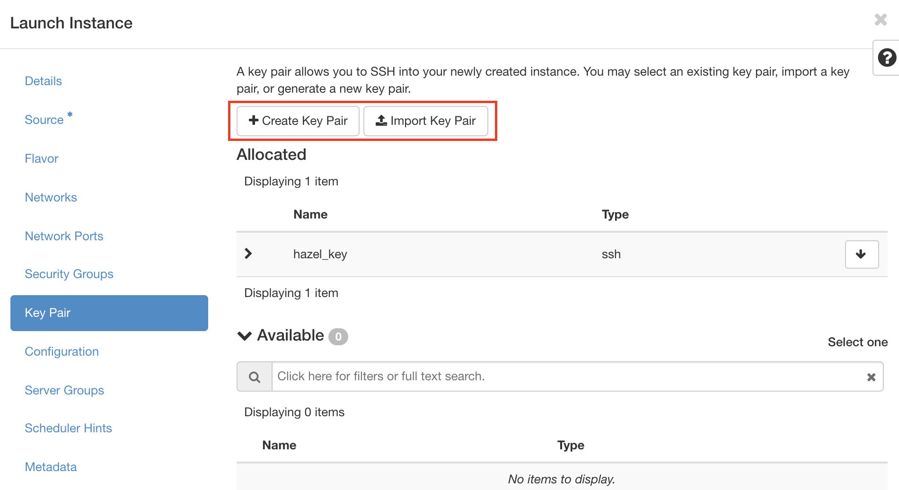
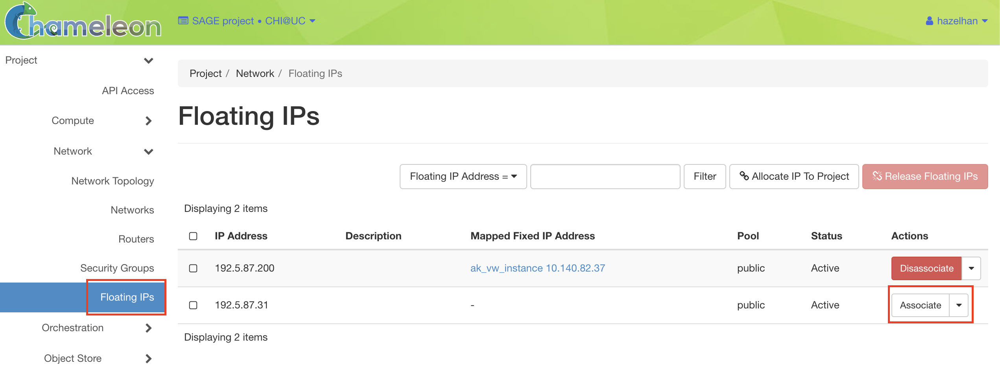
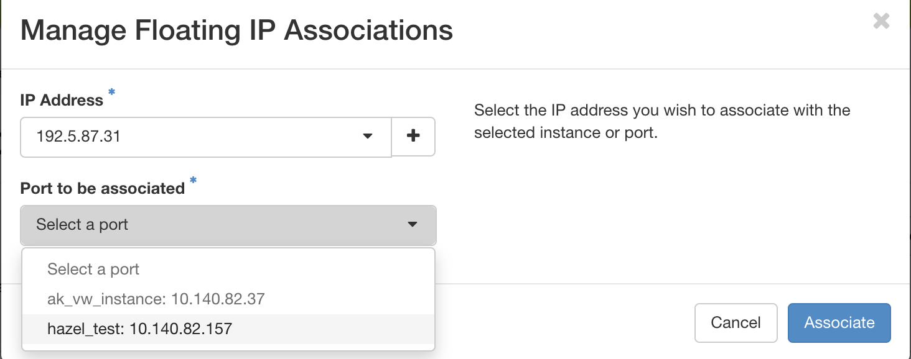

## How to use Chameleon

This step-by-step instruction will guide you on how to use Chameleon.\
This document covers from creating Chameleon account to logging into Chameleon using Floating IP allocated to your instance.\
It also includes a number of screenshots to help you get on Chameleon as easy and fast as possible.\
For more detailed information, you can refer to https://chameleoncloud.readthedocs.io/.\
If you would like to know how to use Chameleon with docker images, refer to https://github.com/sagecontinuum/chameleon-client/.

### Getting started

Go to [ChameleonHome] https://www.chameleoncloud.org/ and sign up. Then, ask PI to get you added on the proper project.\
If you are added to the project, you will be able to access the Chameleon Dashboard.\
Clicking ```CHI@UC``` or ```CHI@TACC``` will lead you to the Dashboard.\

\
Go to the Dashboard and either Create a key pair or Import your SSH public key.\
If you have already generated your own SSH key pair, your public key could be found in ```~/.ssh/id_rsa.pub```.\

\
This key pair will be used when you attempt to run your docker image on Chameleon directly by using CLI.\
For more info on docker and Chameleon, please refer to https://github.com/sagecontinuum/chameleon-client/.\
Otherwise, for native use of Chameleon, follow the instruction below.\

### Create an instance

1. Reserve a Node
Go to the Dashboard again and click *Lease* under *Reservation* from the sidebar. Click on *Create Lease* then the wizard will be loaded.

Name your lease and decide the lease length. Maximum lease length is 7 days. 

Then find *Resource Properties* section and choose proper property for your use. For AI/ML related uses, you might want to choose *node_type* = *gpu_rtx_6000*.
Lastly, indicate the number of Floating IP addresses needed for your use.


2. Launch an Instance
Once your reservation gets ACTIVE, launch a bare-metal instance on the node you have reserved.
Click *instances* under *Compute* from the sidebar, and click *Launch Instance*, then the wizard will be loaded.

Name your instance and associate it with your node (reservation). 

Then click *Source* in sidebar and choose OS image. If you want an image with CUDA installed, search for it. 

For AI/ML related uses, ```CC-Ubuntu18.04-CUDA10``` is highly recommended.

Then, click *Flavor* from the sidebar and check if it is correctly selected as *baremetal* flavor.

Then, click *Key Pair* from the sidebar and either Create a Pair or Import a Pair. In my case, I just allocated the key the I have registered previously.

If you have come so far, you now have basic configuration for your instance! 
Press *Lauch Instance* button on the bottom.

3. Associate Floating IP addresses
Now you will be able to see your instance created as below.

Next step you have to take is associating *Floating IP addresses* with your instance.
Click *Floating IPs* under *Network* from the sidebar. Then you will see an IP address not associated with any other instances. Click the *Associate* button to allocate that IP address to your instance.

Then the wizard will be loaded. Select your instance port for *Port to be associated*.

Now if you go back to *instances* under *Compute* again, you will see your instance created there with the Floating IP you have allocated.


### Accessing your instance
Once your instance has launched with an associated Floating IP address.
You can log in to your Chameleon instance via SSH using the **cc user account and your floating IP address**. 
If your floating IP address was 192.5.87.31, you would use the command: ```ssh cc@192.5.87.31```.
